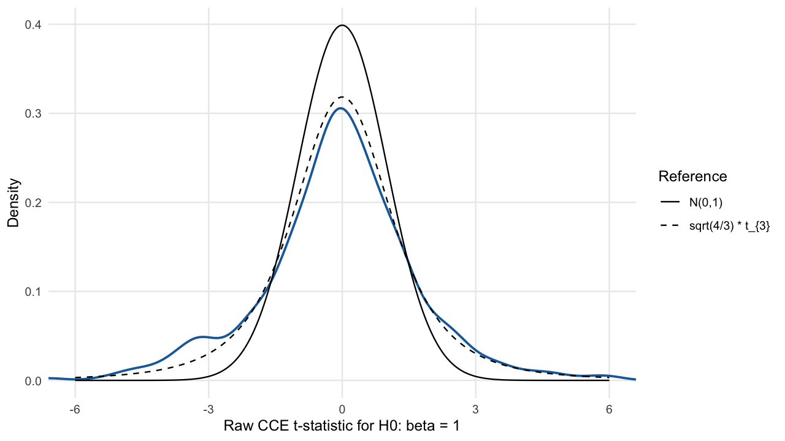
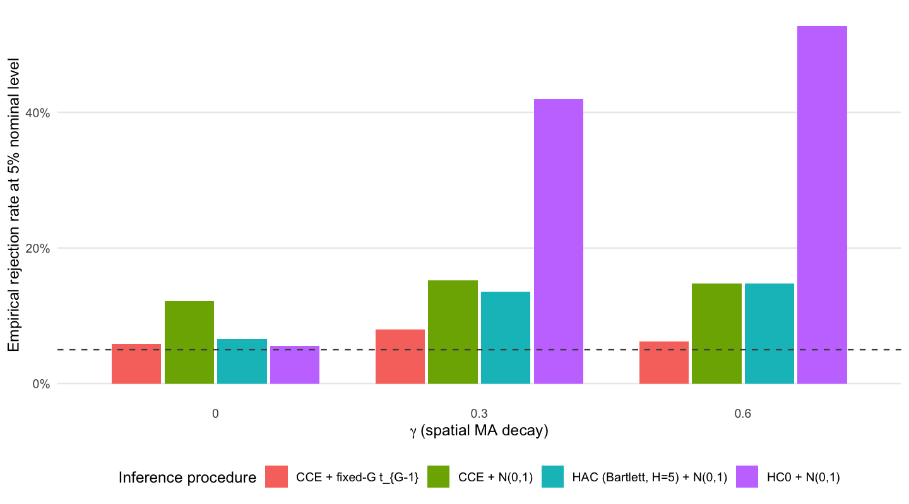
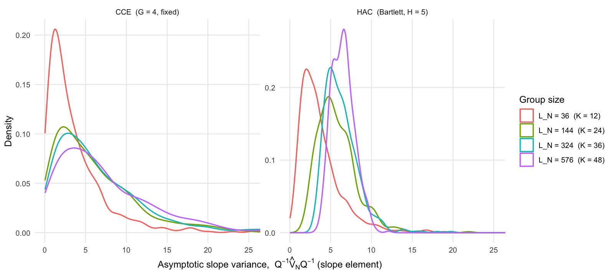

```{r setup, include=FALSE}
knitr::opts_chunk$set(
  echo = FALSE,
  message = FALSE,
  warning = FALSE,
  fig.align = "center",
  fig.pos = "H",
  out.width = "0.92\\linewidth"
)
```

# Monte Carlo Simulation for Fixed-\(G\) Cluster Inference

The following figures illustrate the fixed-\(G\) argument in @bester_conley_hansen_2011, hereafter BCH. Within each large group, the score obeys a central limit theorem; across groups, the scores become asymptotically independent. The CCE is therefore based on \(G\) approximately independent random group scores. If \(G\) is fixed, this is not enough information for the variance estimator to converge to a constant.

## Notation and Simulation Design

Let \((\Omega,\mathcal F,\mathbb P)\) be a probability space. For \(K\in\mathbb N\), define
\[
\mathcal S_K=\{1,\ldots,K\}^2\subset\mathbb Z^2,
\qquad
N_K=K^2,
\]
with metric
\[
d_\infty(s,t)=\max\{|s_1-t_1|,\ |s_2-t_2|\},
\qquad s,t\in\mathbb Z^2.
\]
Let
\[
\mathcal S_K^{+2}
=\{r\in\mathbb Z^2:\exists s\in\mathcal S_K\text{ such that }d_\infty(r,s)\leq 2\}.
\]
On \(\mathcal S_K^{+2}\), let
\[
u:\mathcal S_K^{+2}\times\Omega\to\mathbb R,
\qquad
v:\mathcal S_K^{+2}\times\Omega\to\mathbb R
\]
be two independent Gaussian white-noise fields. Thus all variables \((u_r)_{r\in\mathcal S_K^{+2}}\) and \((v_r)_{r\in\mathcal S_K^{+2}}\) are independent \(N(0,1)\) random variables.

For \(\gamma\in\Gamma=\{0,0.3,0.6\}\), define \(x_\gamma,\varepsilon_\gamma:\mathcal S_K\times\Omega\to\mathbb R\) by
\[
x_\gamma(s,\omega)
= \sum_{h\in\mathbb Z^2:\ d_\infty(h,0)\leq 2}
\gamma^{d_\infty(h,0)}v(s+h,\omega),
\qquad
\varepsilon_\gamma(s,\omega)
= \sum_{h\in\mathbb Z^2:\ d_\infty(h,0)\leq 2}
\gamma^{d_\infty(h,0)}u(s+h,\omega).
\]
This is the spatial moving-average design used in BCH. The structural parameter is \(\beta_0=1\), and
\[
y_\gamma:\mathcal S_K\times\Omega\to\mathbb R,
\qquad
y_\gamma(s,\omega)=\beta_0 x_\gamma(s,\omega)+\varepsilon_\gamma(s,\omega).
\]
Hence \(H_0:\beta=\beta_0\) is true by construction.

After fixing an ordering of \(\mathcal S_K\), let \(X_K(\omega)\in\mathbb R^{N_K\times 2}\) have row \((1,x_\gamma(s,\omega))\), and let \(Y_K(\omega)\in\mathbb R^{N_K}\) collect the outcomes. The OLS estimator is
\[
\widehat\theta_K:\Omega\to\mathbb R^2,
\qquad
\widehat\theta_K(\omega)
=\bigl(X_K(\omega)'X_K(\omega)\bigr)^{-1}X_K(\omega)'Y_K(\omega),
\]
with \(\widehat\theta_K=(\widehat\alpha_K,\widehat\beta_K)'\), whenever \(X_K'X_K\) is nonsingular.

Let \(\mathcal G_K=\{G_{1,K},\ldots,G_{G,K}\}\) be a partition of \(\mathcal S_K\) into \(G\) equal contiguous blocks, with \(L_K=|G_{g,K}|=N_K/G\). The CCE is
\[
\widehat V_K^{CCE}
=\frac{1}{N_K}\sum_{g=1}^{G}
X_{g,K}'\widehat e_{g,K}\widehat e_{g,K}'X_{g,K}
\in\mathbb R^{2\times 2},
\]
where \(X_{g,K}\) and \(\widehat e_{g,K}\) are the restrictions of \(X_K\) and the OLS residual vector to group \(g\). Let
\[
\widehat Q_K=\frac{1}{N_K}X_K'X_K.
\]
The variance object relevant for \(\sqrt{N_K}(\widehat\beta_K-\beta_0)\) is
\[
\left(\widehat Q_K^{-1}\widehat V_K\widehat Q_K^{-1}\right)_{2,2},
\]
not this object divided by \(N_K\).

Let \(a=(0,1)'\in\mathbb R^2\). The raw CCE t-statistic is
\[
T_K^{CCE}:\Omega\to\mathbb R,
\qquad
T_K^{CCE}(\omega)
=
\frac{
\sqrt{N_K}\left(a'\widehat\theta_K(\omega)-\beta_0\right)
}{
\left[
a'\widehat Q_K(\omega)^{-1}
\widehat V_K^{CCE}(\omega)
\widehat Q_K(\omega)^{-1}a
\right]^{1/2}
}.
\]
The BCH statistic is
\[
T_K^{BCH}
=\sqrt{\frac{G-1}{G}}\,T_K^{CCE},
\]
and is compared with \(t_{G-1}\) critical values.

## Simulation Plots

 If \(\widehat V_K^{CCE}\) behaved like a consistent plug-in estimator, a normal approximation would describe the CCE t-statistic under the null. However, BCH instead show that a wider distribution results when \(G\) is fixed.

Figure \ref{fig:fig-a} uses the Monte Carlo draws with \(K=36\), \(\gamma=0.6\), and \(G=4\). For each replication, we estimate OLS under the true null \(H_0:\beta=1\), compute \(T_K^{CCE}\), and plot its density. The solid curve is the \(N(0,1)\) density; the dashed curve is
\[
\sqrt{\frac{G}{G-1}}\,t_{G-1}.
\]
Under the fixed-\(G\) sequence in @bester_conley_hansen_2011, \(G\) is fixed while \(L_K\to\infty\). The raw CCE statistic converges to \(\sqrt{G/(G-1)}\,t_{G-1}\), not to \(N(0,1)\). For \(G=4\), the reference distribution is visibly wider because the denominator is estimated from only four approximately independent group scores.
```{r fig-a, fig.cap="Raw CCE t-statistic under the null. The blue density is the Monte Carlo distribution for K = 36, gamma = 0.6, and G = 4. The solid black curve is the standard normal reference; the dashed curve is the BCH fixed-G reference distribution."}

```

A distributional approximation matters because it determines test size. Since the null is true in every replication, a correctly calibrated 5% test should reject close to 5% of the time.

For \(K=36\) and \(G=9\), we compute rejection frequencies over \(\gamma\in\{0,0.3,0.6\}\). The procedures differ only in the variance estimator and reference distribution: HC0 with normal critical values, Bartlett HAC with \(H=5\) and normal critical values, CCE with normal critical values, and CCE with the BCH correction \(T_K^{BCH}\) compared to \(t_{G-1}\). The dashed horizontal line is 5%.

Normal critical values treat the estimated variance as essentially known. The BCH procedure instead accounts for the fact that, under fixed \(G\), variance estimation is based on only \(G\) group-level pieces of information. This is why the CCE with fixed-\(G\) critical values stays much closer to nominal size.


```{r fig-b, fig.cap="Empirical size under the true null for G = 9. The bars report rejection rates for nominal 5 percent tests across spatial dependence parameters. The dashed horizontal line is the target 5 percent rejection rate."}

```


The fixed-\(G\) logic is easiest to see in the variance estimator itself. The CCE is not supposed to converge to a constant when \(G\) is fixed; it converges to a non-degenerate random limit. Figure \ref{fig:fig-c} plots the Monte Carlo distribution of
\[
\left(\widehat Q_K^{-1}\widehat V_K\widehat Q_K^{-1}\right)_{2,2},
\]
the asymptotic variance scale for \(\sqrt{N_K}(\widehat\beta_K-\beta_0)\). We plot it for \(G=4\), \(\gamma=0.6\), and increasing \(K\), hence increasing \(L_K\). It is deliberately not divided by \(N_K\): the actual variance of \(\widehat\beta_K\) shrinks mechanically like \(1/N_K\), which is not the object at issue.

 The CCE density remains dispersed as \(L_K\) grows because fixed \(G\) leaves only \(G\) observations on the group-score variance. The HAC panel is a local-covariance contrast whose sampling variation concentrates as the lattice grows.
```{r fig-c, fig.cap="Sampling variation of the asymptotic-scale slope variance estimate. The CCE panel keeps G fixed at 4 while group size grows; the HAC panel is included as a local-covariance concentration comparison."}

```


The figures separate two ideas that are easy to conflate. First, large groups justify approximately normal and independent group scores. Second, fixed \(G\) means the variance estimator is still random, because it is based on only \(G\) group-level pieces of information. The fixed-\(G\) critical values in @bester_conley_hansen_2011 target this second source of uncertainty.

# References
