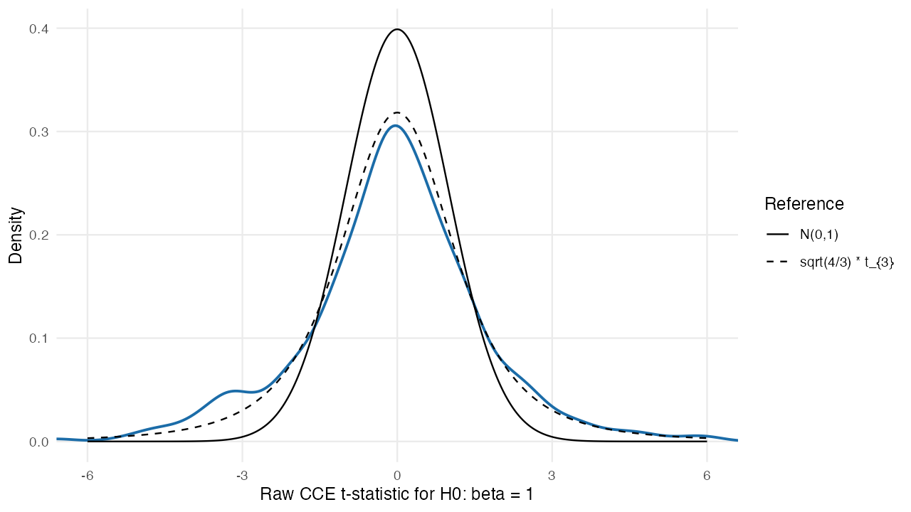
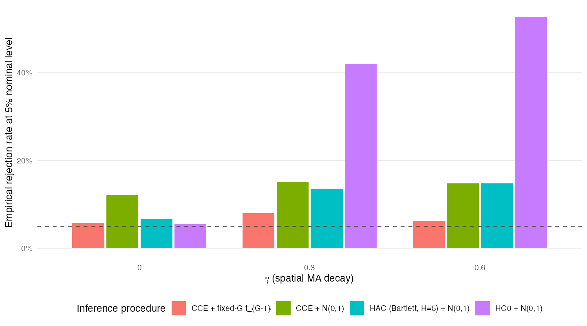
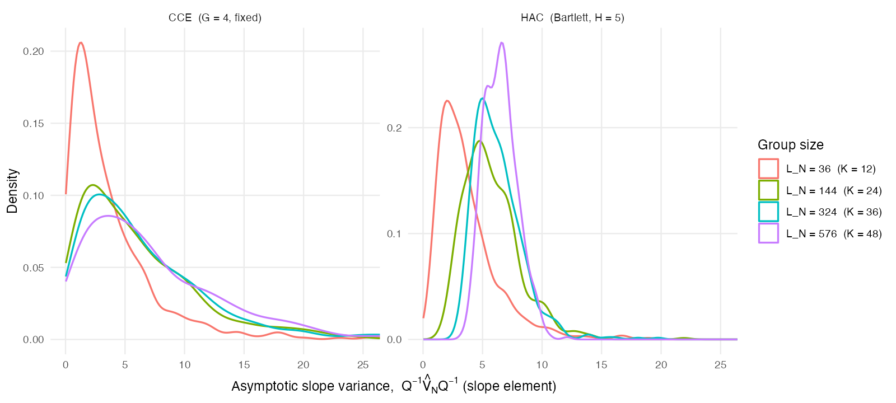

```{r setup, include=FALSE}
knitr::opts_chunk$set(
  echo = FALSE,
  message = FALSE,
  warning = FALSE,
  fig.align = "center",
  out.width = "0.92\\linewidth"
)
```

## Overview

These figures illustrate Bester, Conley, and Hansen's fixed-\(G\) argument in the spatial moving-average Monte Carlo. The key point is not that cluster scores converge to constants. Within each large group, the score obeys a central limit theorem; across groups, the scores become asymptotically independent. With \(G\) fixed, the cluster covariance estimator (CCE) is therefore built from only \(G\) approximately independent random scores, so its limit remains random.

The simulation uses the paper's spatial moving-average design on a \(K \times K\) lattice:
\[
x_s = \sum_{\lVert h \rVert \leq 2}\gamma^{\lVert h \rVert}v_{s+h},
\qquad
\varepsilon_s = \sum_{\lVert h \rVert \leq 2}\gamma^{\lVert h \rVert}u_{s+h},
\]
with \(y_s = x_s\beta + \varepsilon_s\) and \(\beta = 1\). The null hypothesis is true in every Monte Carlo replication.

## Figure A: CCE t-statistic

```{r fig-a, fig.cap="Raw CCE t-statistic under the null. The blue density is the Monte Carlo distribution for K = 36, gamma = 0.6, and G = 4. The dashed reference is the BCH fixed-G limit."}

```

The null is true, so a conventional plug-in argument would suggest a \(N(0,1)\) reference distribution. BCH instead keep the number of groups fixed and let each group grow. The raw CCE statistic has limiting reference distribution
\[
\sqrt{\frac{G}{G-1}}\,t_{G-1}.
\]
For \(G=4\), this is much wider than \(N(0,1)\), because the denominator is estimated from only four approximately independent group scores.

## Figure B: Rejection Rates

```{r fig-b, fig.cap="Empirical rejection rates for nominal 5 percent tests under the true null. The dashed horizontal line is the target size."}

```

The dashed line is the nominal 5% rejection rate. Procedures using \(N(0,1)\) critical values treat the variance estimate as essentially known. The BCH procedure rescales the CCE t-statistic by \(\sqrt{(G-1)/G}\) and uses \(t_{G-1}\) critical values, which accounts for fixed-\(G\) variance-estimation uncertainty.

## Figure C: Variance Estimator

```{r fig-c, fig.cap="Sampling distribution of the asymptotic-scale slope variance estimate. The CCE panel keeps G fixed while group size grows."}

```

The plotted object is
\[
\left(Q^{-1}\hat V_N Q^{-1}\right)_{\text{slope},\text{slope}},
\]
the asymptotic variance scale for \(\sqrt{N}(\hat\beta-\beta)\). This is deliberately not divided by \(N\). The actual variance of \(\hat\beta\) shrinks like \(1/N\) for any sensible estimator, so plotting that object would miss the BCH point.

The CCE density remains dispersed as \(L_N\) grows because fixed \(G\) leaves only \(G\) pieces of information about the group-score variance. The HAC panel is a local-covariance contrast whose sampling variation concentrates as the lattice grows. In this simulation \(H\) is fixed at 5, so it should be read as a concentration comparison rather than an exact implementation of a growing-bandwidth HAC sequence.

## Takeaway

The figures separate two ideas that are easy to conflate. First, large groups justify approximately normal and independent group scores. Second, fixed \(G\) means the variance estimator is still random, because it is based on only \(G\) group-level pieces of information. BCH's fixed-\(G\) critical values target that second source of uncertainty.
